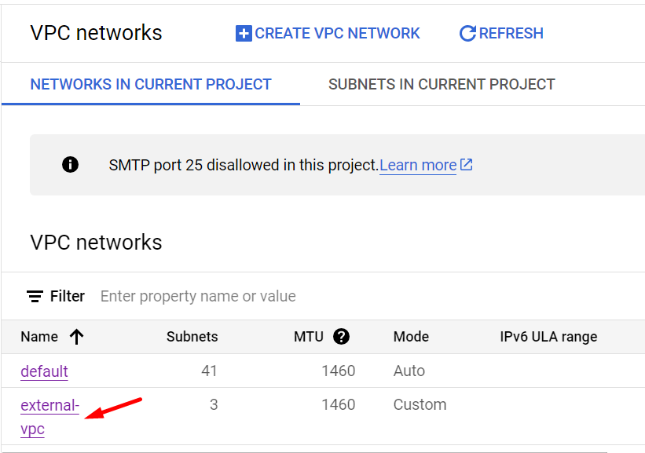
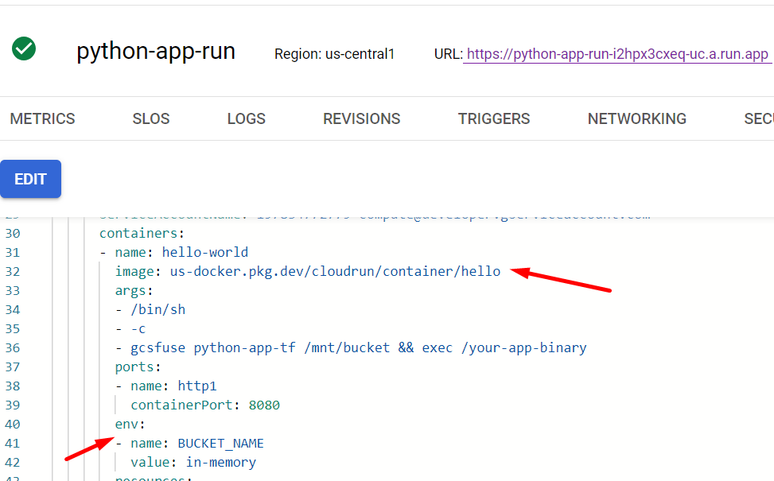
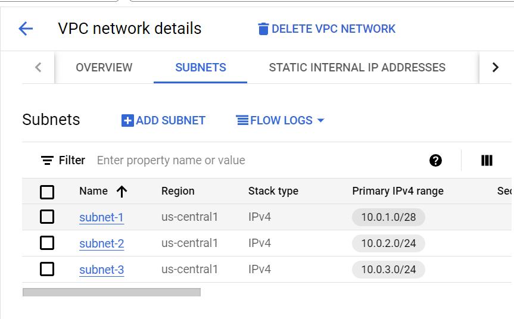
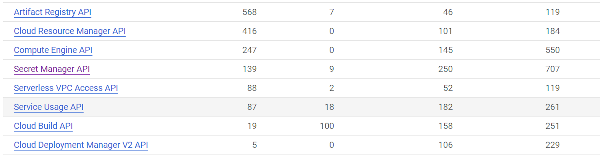
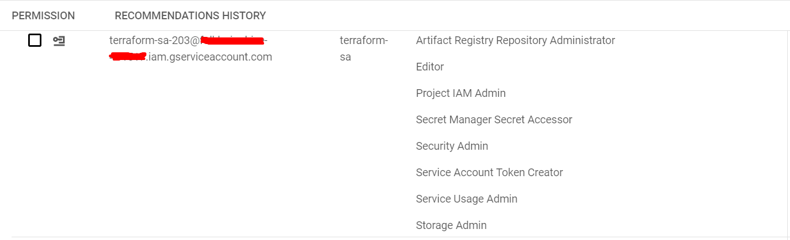
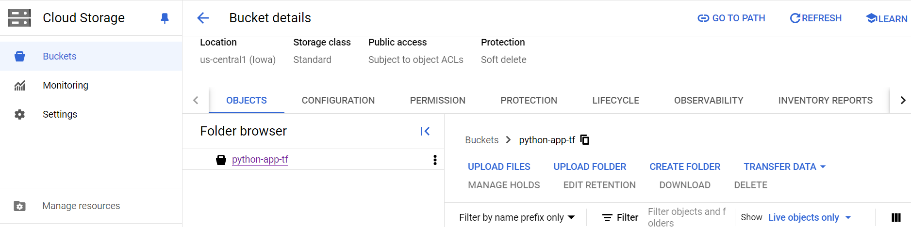
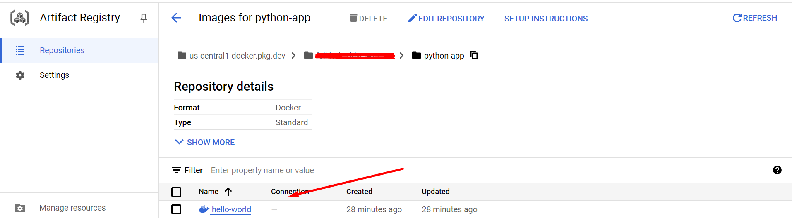
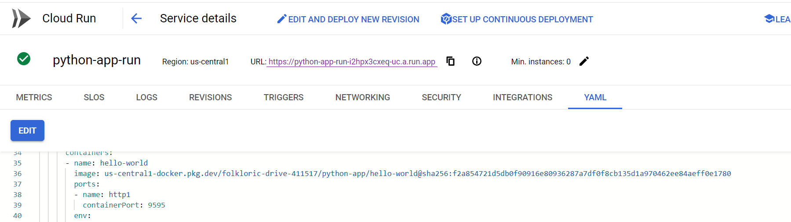

# Setting Up Infrastructure with Terraform Module on Google Cloud Platform

This guide helps you use Terraform to manage infrastructure on Google Cloud Platform (GCP) in a structured way. You'll set up service accounts, VPCs, subnets, and potentially Cloud Run resources.

1. **Install Google Cloud SDK and Authenticate**

- Install the Google Cloud SDK and authenticate with your GCP account.

- Set your project as the default for future commands.

1. **Create Terraform Configuration Files**

- **main.tf**: Contains provider details and configurations, such as for Secret Manager.

- **version.tf**: Specifies the Terraform version to use.

- **variables.tf**: Defines project-specific variables like project ID and region. \


1. **Set Up Service Account**

- Use Terraform to create a service account with required permissions.

- Download its JSON key (`gcp-keys.json`) and store it in your project directory for authentication. \


1. **Organize into Modules for Manageability**

- **vpc-module/**:

- variables.tf: Defines VPC and subnet configurations.

- vpc.tf: Sets up VPC resources.

- subnets.tf: Defines subnet configurations.

- cloud-run.tf : Set up the cloud run with volume and noAuth policy

- outputs.tf: Captures useful resource information.





1. **Create Main Module**

- Define necessary variables in the root directory's main module.

- Include the `vpc-module` to create VPCs and subnets.




1. **Enable Required APIs and Assign Roles**





- Apply Terraform commands to initialize and deploy configurations, ensuring all components are set up correctly.

**How Terraform Modules are Reusable: \
Flexibility**: Modify variables in `variables.tf` to perform CRUD operations on resources.

- **Code Reuse**: Avoid rewriting code for creating new VPCs, subnets, or Cloud Run resources. Use existing modules and update configurations as needed.


**Setting Up CI/CD with Terraform**

This guide walks you through setting up a Cloud Run service on Google Cloud Platform (GCP) using Terraform. The goal is to create a new GCP project, enable necessary services, build and deploy a "Hello World" Docker application, and configure supporting infrastructure.

**Before You Start**

Make sure you have these installed:

- Google Cloud SDK

- Terraform

- Docker

**1. Install and Authenticate**

Install the Google Cloud SDK and log in with your GCP account. Set your project as the default for further commands.

**2. Prepare Terraform Files**

Create key Terraform files:

- **main.tf:** Includes provider details and configurations for Secret Manager.

- **version.tf:** Specifies the Terraform version.

- **variables.tf:** Defines project-specific variables like project ID and region.

**3. Create Service Account**

Use Terraform to create a service account. This account will have necessary permissions. Download its JSON key (`gcp-keys.json`) and keep it in your project directory.

**4. Set Up Artifact Registry**

Use Terraform to establish a Google Artifact Registry. This will store Docker images for your application. Configuration details are in `artifact.tf`. \




**6. Create Build and push to artifact registry**

For building a Docker image we required Dockerfile for our application. Create Dockerfile and place it with application code.

Before you can push or pull images, we need to configure Docker to use the Google Cloud CLI to authenticate requests to Artifact Registry.

1. Authenticate Docker with Artifact Registry  \
- To set up authentication to Docker repositories in the region us-central1

```
gcloud auth configure-docker us-central1-docker.pkg.dev
```
2. Create docker image of your application

```
docker build -t hello-world:v1 .
```
3.  Tag your Docker image

```
docker tag hello-world:v1 \ us-central1-docker.pkg.dev/{Project_ID}/python-app/hello-world:v1
```
4. Push the Docker image

```
docker push us-central1-docker.pkg.dev/{Project_ID}/python-app/hello-world:v1
```


**7. Deploy Cloud Run Service**


 \
Use this URL to check the Hello world python app :[ https://python-app-run-i2hpx3cxeq-uc.a.run.app](https://python-app-run-i2hpx3cxeq-uc.a.run.app/)

**8. Additional Setup**


- Apply Terraform commands to initialize and deploy configurations, ensuring all components are correctly set up.
